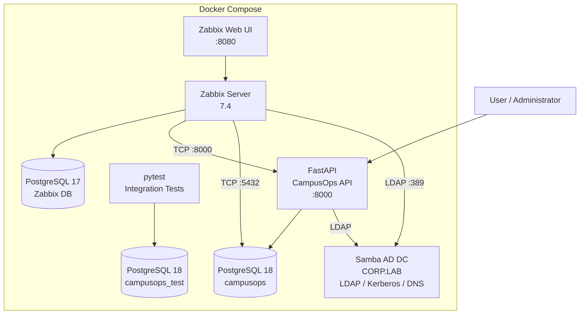

# 🛠️ CampusOps

> Лабораторная система для управления сотрудниками, устройствами и обращениями с интеграцией PostgreSQL, Active Directory и Zabbix.


---

## 📌 О проекте

**CampusOps** — учебно-практический инфраструктурный проект, объединяющий backend-разработку и задачи системного администрирования.

В рамках проекта реализованы:

- REST API на FastAPI;
- PostgreSQL и SQLAlchemy;
- управление схемой БД через Alembic;
- Docker / Docker Compose;
- изолированная PostgreSQL-база для тестов;
- интеграционные тесты через pytest;
- резервное копирование и восстановление PostgreSQL;
- Samba Active Directory Domain Controller;
- LDAP-интеграция приложения с Active Directory;
- синхронизация пользователей AD в PostgreSQL;
- преобразование AD-групп в роли приложения;
- мониторинг сервисов через Zabbix;
- автоматическое обнаружение отказа и восстановления API.

---

# 🏗️ Архитектура



---

# ⚙️ Технологии

| Направление | Используется |
|---|---|
| Backend | Python 3.13, FastAPI |
| ORM | SQLAlchemy 2 |
| Database | PostgreSQL 18 |
| Migrations | Alembic |
| Containers | Docker, Docker Compose |
| Testing | pytest, httpx, pytest-cov |
| Directory Service | Samba Active Directory DC |
| Authentication integration | LDAP |
| AD services | LDAP, Kerberos, DNS |
| Monitoring | Zabbix 7.4 |
| Backup | pg_dump |
| Recovery | pg_restore |
| Administration | PowerShell, Bash, psql, samba-tool |

---

# 📂 Структура проекта

```text
CampusOps/
│
├── app/
│   ├── main.py
│   ├── config.py
│   ├── db.py
│   ├── models.py
│   ├── schemas.py
│   │
│   ├── routers/
│   │   ├── employees.py
│   │   ├── devices.py
│   │   ├── tickets.py
│   │   └── ad.py
│   │
│   └── services/
│       └── active_directory.py
│
├── alembic/
│   └── versions/
│       └── 0001_initial_schema.py
│
├── infra/
│   └── active-directory/
│       ├── Dockerfile
│       └── entrypoint.sh
│
├── scripts/
│   ├── postgres_lab.sql
│   ├── backup.ps1
│   └── restore.ps1
│
├── tests/
│   ├── conftest.py
│   ├── test_system.py
│   ├── test_employees.py
│   ├── test_devices.py
│   └── test_tickets.py
│
├── .env.example
├── alembic.ini
├── compose.yaml
├── Dockerfile
├── requirements.txt
└── README.md
```

---

# 🚀 Запуск

## 1. Конфигурация окружения

Создать `.env` на основе:

```text
.env.example
```

Пример основных параметров:

```env
APP_NAME=CampusOps
APP_ENV=development
DEBUG=true

POSTGRES_HOST=db
POSTGRES_PORT=5432
POSTGRES_DB=campusops
POSTGRES_USER=campusops
POSTGRES_PASSWORD=change_me

AD_ENABLED=true
AD_SERVER=ad-dc
AD_PORT=389
AD_DOMAIN=corp.lab
AD_BASE_DN=DC=corp,DC=lab
AD_BIND_USER=svc-campusops@corp.lab
AD_BIND_PASSWORD=change_me
```

> `.env` не хранится в Git.

---

## 2. Запуск API и PostgreSQL

```bash
docker compose up -d --build
```

Проверка контейнеров:

```bash
docker compose ps
```

API:

```text
http://localhost:8000
```

Swagger:

```text
http://localhost:8000/docs
```

Health check:

```text
http://localhost:8000/health
```

Readiness check:

```text
http://localhost:8000/ready
```

---

# 🗄️ PostgreSQL

В проекте реализована полноценная схема данных:

```text
employees
devices
tickets
```

Используются:

- Primary Key;
- Foreign Key;
- UNIQUE constraints;
- индексы;
- составные индексы;
- связи между сущностями;
- транзакции;
- rollback;
- миграции.

---

## Alembic

Применение миграций:

```bash
docker compose exec api alembic upgrade head
```

Текущая версия:

```bash
docker compose exec api alembic current
```

---

# 🔬 PostgreSQL Lab

Файл:

```text
scripts/postgres_lab.sql
```

Лабораторный сценарий включает:

- просмотр структуры БД;
- просмотр индексов;
- просмотр внешних ключей;
- `BEGIN`;
- `COMMIT / ROLLBACK`;
- массовую генерацию тестовых данных;
- `ANALYZE`;
- `EXPLAIN`;
- `EXPLAIN ANALYZE`;
- сравнение запросов по индексированным полям.

---

# 💾 Backup / Restore

Резервное копирование выполняется через `pg_dump` в custom-format.

```powershell
.\scripts\backup.ps1
```

Восстановление выполняется в отдельную базу:

```text
campusops_restore
```

Команда:

```powershell
.\scripts\restore.ps1
```

В процессе проверяются:

- восстановленные таблицы;
- версия Alembic;
- количество записей;
- целостность структуры БД.

Основная БД при проверке восстановления не уничтожается.

---

# 🧪 pytest

Для тестов используется отдельная PostgreSQL-база:

```text
campusops_test
```

Это исключает изменение основной базы во время тестирования.

Запуск:

```bash
docker compose --profile test run --rm tests
```

Результат тестирования:

```text
24 passed
```

Покрытие:

```text
TOTAL: 83%
```

Тестируются:

- system endpoints;
- employees CRUD;
- devices CRUD;
- tickets CRUD;
- validation;
- duplicate constraints;
- ошибки БД;
- rollback после `IntegrityError`;
- HTTP API;
- работа приложения с PostgreSQL.

Используются:

- fixtures;
- autouse fixtures;
- parametrization;
- TestClient;
- isolated database;
- pytest-cov.

---

# 👥 Active Directory

Для лаборатории развёрнут **Samba Active Directory Domain Controller**.

Домен:

```text
CORP.LAB
```

NetBIOS domain:

```text
CORP
```

Контроллер:

```text
DC01.CORP.LAB
```

Используемые AD-компоненты:

- LDAP;
- Kerberos;
- DNS;
- domain users;
- security groups;
- service account;
- group membership.

Запуск:

```bash
docker compose --profile infra up -d ad-dc
```

---

## Пользователи

Лабораторные учётные записи:

```text
svc-campusops
tivanov
petrov
admin.demo
```

Просмотр:

```bash
docker compose exec ad-dc samba-tool user list
```

---

## Группы

Созданы:

```text
Employees
HelpDesk
App-Admins
VPN-Users
```

Например:

```text
tivanov
├── Employees
└── HelpDesk
```

Проверка:

```bash
docker compose exec ad-dc samba-tool group listmembers HelpDesk
```

---

# 🔗 LDAP-интеграция

CampusOps выполняет LDAP bind через отдельную service account:

```text
svc-campusops@corp.lab
```

Приложение может:

- проверить доступность AD;
- найти пользователя по `sAMAccountName`;
- получить Distinguished Name;
- получить `memberOf`;
- получить группы пользователя;
- преобразовать группы AD в application roles;
- сохранить пользователя в PostgreSQL.

---

## Проверка AD

```http
GET /ad/status
```

Пример:

```json
{
  "enabled": true,
  "status": "available",
  "server": "ad-dc",
  "domain": "corp.lab"
}
```

---

## Получение пользователя

```http
GET /ad/users/tivanov
```

Пример:

```json
{
  "username": "tivanov",
  "email": "tivanov@corp.lab",
  "distinguished_name": "CN=tivanov,CN=Users,DC=corp,DC=lab",
  "groups": [
    "Employees",
    "HelpDesk"
  ],
  "role": "support"
}
```

---

# 🔄 AD → PostgreSQL Sync

Синхронизация:

```http
POST /ad/sync/tivanov
```

Пример результата:

```json
{
  "created": true,
  "username": "tivanov",
  "role": "support",
  "groups": [
    "Employees",
    "HelpDesk"
  ]
}
```

После синхронизации пользователь появляется в таблице `employees`.

### Role mapping

```text
App-Admins → admin
HelpDesk   → support
Employees  → user
```

Таким образом изменение членства пользователя в Active Directory может изменять его роль внутри CampusOps.

---

# 📊 Zabbix

Для мониторинга используется **Zabbix 7.4**.

Архитектура:

```text
zabbix-web
     │
     ▼
zabbix-server
     │
     ▼
zabbix-db
```

Web UI:

```text
http://localhost:8080
```

---

## Мониторинг CampusOps

Создан Zabbix host:

```text
CampusOps Services
```

Контролируются:

| Item | Проверка |
|---|---|
| CampusOps API TCP | `api:8000` |
| CampusOps PostgreSQL TCP | `db:5432` |
| CampusOps Active Directory LDAP | `ad-dc:389` |

Используются Zabbix Simple Checks.

Например:

```text
net.tcp.service[tcp,api,8000]
```

---

# 🚨 Проверка отказоустойчивости мониторинга

Создан trigger:

```text
CampusOps API unavailable
```

Expression:

```text
last(/CampusOps Services/net.tcp.service[tcp,api,8000])=0
```

Практический тест:

```bash
docker compose stop api
```

Zabbix обнаруживает отказ:

```text
HIGH
PROBLEM
CampusOps API unavailable
```

После запуска:

```bash
docker compose start api
```

Zabbix фиксирует восстановление:

```text
RESOLVED
```

Таким образом проверен полный monitoring lifecycle:

```text
AVAILABLE
   ↓
SERVICE DOWN
   ↓
PROBLEM
   ↓
SERVICE START
   ↓
RESOLVED
```

---

# 🌐 REST API

Основные endpoint-группы:

### Employees

```text
POST   /employees
GET    /employees
GET    /employees/{id}
PATCH  /employees/{id}
DELETE /employees/{id}
```

### Devices

```text
POST   /devices
GET    /devices
GET    /devices/{id}
PATCH  /devices/{id}
DELETE /devices/{id}
```

### Tickets

```text
POST   /tickets
GET    /tickets
GET    /tickets/{id}
PATCH  /tickets/{id}
DELETE /tickets/{id}
```

### Active Directory

```text
GET  /ad/status
GET  /ad/users/{username}
POST /ad/sync/{username}
```

### System

```text
GET /
GET /health
GET /ready
```

---

# 🐳 Docker Compose

Проект состоит из нескольких независимых сервисов.

Основной стек:

```text
api
db
```

Test profile:

```text
test-db
tests
```

Infrastructure profile:

```text
ad-dc
zabbix-db
zabbix-server
zabbix-web
```

Запуск всей инфраструктуры:

```bash
docker compose --profile infra up -d
```

---

# 🔐 Безопасность

Проект предназначен для локальной лабораторной среды.

Секреты:

- не хранятся в Git;
- передаются через `.env`;
- `.env` добавлен в `.gitignore`;
- `.env.example` содержит только примеры.

LDAP в лаборатории используется через порт `389`.

Для production-среды следует использовать:

```text
LDAPS :636
```

с корректной PKI/сертификатами.

---

# 🎯 Что демонстрирует проект

CampusOps создавался как практическая лаборатория для закрепления навыков:

```text
Docker
Docker Compose
PostgreSQL
SQLAlchemy
Alembic
pytest
Backup / Restore
Active Directory
LDAP
Kerberos
DNS
Zabbix
Linux
PowerShell
REST API
```

Ключевой принцип проекта — не просто добавить технологии в список зависимостей, а проверить их в рабочих сценариях:

```text
PostgreSQL
    → migration
    → transaction
    → EXPLAIN ANALYZE
    → backup
    → restore

pytest
    → isolated database
    → integration tests
    → coverage

Active Directory
    → user
    → group
    → LDAP
    → FastAPI
    → PostgreSQL

Zabbix
    → monitoring
    → service failure
    → PROBLEM
    → recovery
    → RESOLVED
```

---

# ✅ Итог

Проект объединяет backend и инфраструктурные задачи в одном воспроизводимом Docker-стенде.

Реализованы и практически проверены:

- ✅ Docker
- ✅ PostgreSQL
- ✅ pytest
- ✅ Active Directory / LDAP
- ✅ Zabbix
- ✅ Backup & Recovery
- ✅ Database migrations
- ✅ REST API
- ✅ Service monitoring
- ✅ Failure detection

---

## 👨‍💻 CampusOps

**Infrastructure & Backend Laboratory Project**